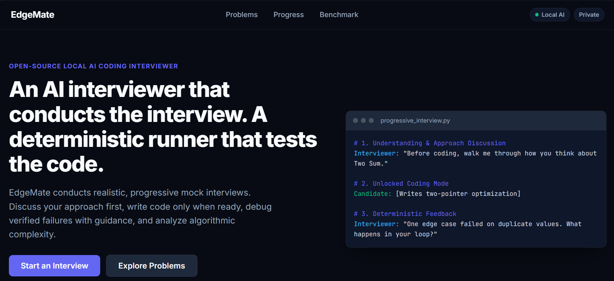
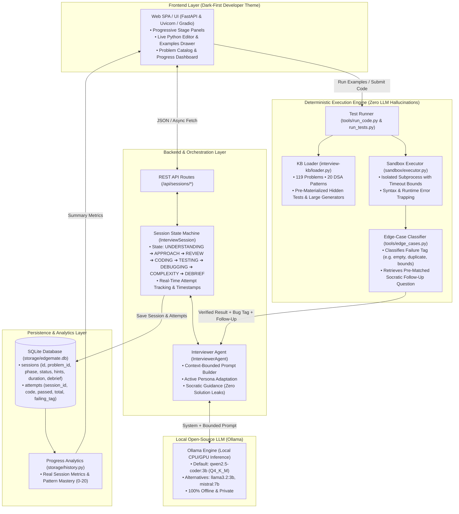
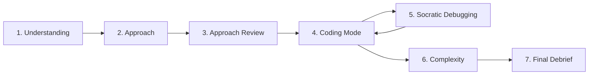

# EdgeMate

> **Local Open-Source AI Coding Interviewer**
>
> *"The code runner checks whether the solution works. The open-source AI handles the human part of the interview."*

---

# Demo
[](https://youtu.be/pWz3XlsvSXk)



---

## The Problem

Practicing for technical coding interviews is notoriously stressful:

- **Mock interviews with peers or coaches** require advance scheduling, induce high social anxiety, and can be expensive.
- **Generic LLM chatbots (e.g., ChatGPT, Claude)** hallucinate code correctness, fail to catch subtle edge-case bugs (off-by-one errors, pointer loops, integer bounds), or immediately dump the entire working solution, spoiling the learning process.
- **Online Judges (e.g., LeetCode)** provide deterministic automated testing but offer zero conversational practice, no probing questions, and no coaching on articulating approaches and algorithmic complexity.

Candidates who have faced interview rejections need a **private, low-pressure, offline mock interviewer** where they can build genuine problem-solving confidence through authentic interview dynamics.

---

## Comparison: Why Traditional Approaches Fall Short

| Dimension | Online Judges (LeetCode, HackerRank) | Generic Cloud Chatbots (ChatGPT, Claude) | EdgeMate (Local AI Interviewer) |
|---|---|---|---|
| **Code Correctness** | Deterministic test execution | LLM hallucination / unreliable parsing | **100% Deterministic subprocess runner** |
| **Conversational Dynamics** | None (solitary editor) | Generic chatbot dialogue | **Stage-based progressive mock interview** |
| **Edge-Case Diagnosis** | Dumps raw failing input | Guesses or gives away the answer | **Classified failure tags + Socratic questions** |
| **Complexity Analysis** | Static charts | Inconsistent explanations | **Interactive dialogue (Time & Space vs Target Big-O)** |
| **Privacy & Cost** | Cloud-based | Paid token APIs / cloud logging | **100% Local, offline, zero token fees** |
| **Solution Spoiling** | Unlocks solution button | Frequently dumps full Python code | **Strict zero-leak architecture** |

---

## Core Architectural Principle: Code Checks, Model Talks

### The Trap of LLM Code Evaluation
Traditional AI interviewers ask the LLM: *"Is this code correct? Find the bugs."* This model-as-judge pattern fails consistently:
* LLMs cannot reliably execute recursive code, pointer cycles, or complex dynamic programming matrices in memory.
* LLMs struggle with large inputs ($N > 10^5$) and edge cases (empty collections, duplicates, signed integer limits).
* LLMs unpredictably leak reference solutions or give confusing, inconsistent advice.

### The EdgeMate Solution
EdgeMate enforces a strict separation of concerns:

```text
Candidate Code  ──►  Deterministic Runner  ──►  Verified Result (Pass/Fail + Tag)
                                                        │
                                                        ▼
Candidate Chat  ◄──  AI Interviewer (Ollama)  ◄──  KB Follow-Up Question
```

* **Correctness is 100% deterministic**: Handled by python subprocess tests against the verified [`interview-kb/`](interview-kb).
* **The LLM never evaluates code directly**: It only receives structured execution results (`tests_passed`, `tests_total`, `failing_tag`) and pre-authored follow-up questions from the Knowledge Base.
* **No Reference Solution Leakage**: The model is never shown the reference implementation.

---

## The 7-Stage Progressive Interview Lifecycle

Rather than immediately presenting a code editor beside a chat window, EdgeMate conducts a realistic, state-driven interview:



### 1. Understanding Check (`UNDERSTANDING`)
* **UI**: Candidate sees problem title, difficulty, pattern, and statement. The code editor and optimal Big-O complexity are hidden.
* **Flow**: The AI interviewer greets the candidate and prompts them to explain the problem requirements, expected inputs/outputs, and edge constraints in their own words.
* **Goal**: Validate candidate comprehension before any coding begins.

### 2. Approach Discussion (`APPROACH`)
* **UI**: Discussion panel remains active.
* **Flow**: The candidate describes their high-level strategy (e.g., brute-force vs. two-pointer vs. sliding window).
* **Goal**: The AI provides feedback on the conceptual idea, gently questioning suboptimal time complexities without writing code.

### 3. Approach Review (`APPROACH_REVIEW`)
* **UI**: Displays a visual checklist confirming:
  - Problem requirements understood
  - Algorithmic strategy identified
  - Optimization invariants discussed
* **Flow**: The candidate clicks **`[Start Coding →]`** to transition into coding mode.

### 4. Coding Mode (`CODING`)
* **UI**: Unlocks the responsive Python code editor with starter function signature, problem constraints, and hint controls.
* **Dual Execution Triggers**:
  - **`[Run Examples]`**: Executes only the visible problem example test cases. The AI provides conversational feedback on the example run.
  - **`[Submit Solution]`**: Executes the full deterministic hidden test suite (including scale bounds).
* **Progressive Hint Ladder**: If stuck, the candidate can request hints in sequence:
  - *Level 1: Guiding Question*
  - *Level 2: Algorithmic Nudge*
  - *Level 3: Concrete Invariant Hint*

### 5. Socratic Debugging (`DEBUGGING`)
* **UI**: If submission tests fail, test results display the number of passed tests and the high-level failing category without spoiling the input data.
* **Flow**: The AI interviewer asks a targeted Socratic question matched to the specific failure tag (e.g., duplicate elements, empty string, boundary values).
* **Goal**: Guides the candidate to identify and fix the bug themselves.

### 6. Complexity Analysis (`COMPLEXITY`)
* **UI**: Once all deterministic tests pass, the editor locks and the complexity discussion panel opens.
* **Flow**: The interviewer asks for **Time Complexity**, evaluates the candidate's explanation, then asks for **Space Complexity**, comparing both against the problem's theoretical benchmarks.

### 7. Comprehensive Debrief (`DEBRIEF` & `COMPLETE`)
* **UI**: Generates a structured 4-pillar interview debrief:
  1. **Approach & Problem Solving**: Evaluation of candidate's initial strategy and algorithmic reasoning.
  2. **Code Quality & Correctness**: Test performance, clean code structure, and edge-case handling.
  3. **Complexity Analysis**: Accuracy in identifying Big-O time and space bounds.
  4. **Communication & Interview Presence**: Clarity of explanations and response to interviewer cues.
* **Persistence**: The completed session, attempts, timestamps, and duration are saved to SQLite (`storage/edgemate.db`).

---

## Knowledge Base (`interview-kb`)

EdgeMate includes a verified Knowledge Base acting as the **single source of truth**:

```text
interview-kb/
├── index.json                  # Problem registry and metadata
├── loader.py                   # Problem loader and dynamic test materializer
├── runner.py                   # Deterministic subprocess execution harness
├── verify.py                   # Schema and test-suite integrity validator
├── personas/                   # Markdown persona instructions (Friendly, Standard, Silent)
└── problems/                   # 119 verified JSON problem definitions
```

### Coverage across 20 DSA Patterns (119 Problems)
1. **Sliding Window** (e.g., Longest Substring Without Repeating Characters, Minimum Window Substring)
2. **Two Pointers** (e.g., Two Sum II, 3Sum, Container With Most Water, Trapping Rain Water)
3. **Fast & Slow Pointers** (e.g., Linked List Cycle, Find the Duplicate Number)
4. **Binary Search (Sorted Array)** (e.g., Search in Rotated Sorted Array, Find Minimum in Rotated Sorted Array)
5. **Binary Search (On Answer Space)** (e.g., Koko Eating Bananas, Capacity To Ship Packages)
6. **Hashing & Frequency Maps** (e.g., Group Anagrams, Top K Frequent Elements)
7. **Prefix Sum** (e.g., Subarray Sum Equals K, Continuous Subarray Sum)
8. **Difference Array** (e.g., Corporate Flight Bookings, Car Pooling)
9. **Monotonic Stack** (e.g., Daily Temperatures, Next Greater Element, Largest Rectangle in Histogram)
10. **Monotonic Queue** (e.g., Sliding Window Maximum)
11. **Heaps & Top-K** (e.g., Kth Largest Element in an Array, Find Median from Data Stream)
12. **Intervals** (e.g., Merge Intervals, Non-overlapping Intervals, Insert Interval)
13. **Greedy Algorithms** (e.g., Jump Game, Gas Station, Task Scheduler)
14. **Linked List Manipulation** (e.g., Reverse Linked List, Merge k Sorted Lists)
15. **Tree DFS** (e.g., Maximum Depth of Binary Tree, Lowest Common Ancestor, Path Sum III)
16. **Tree BFS / Level Order** (e.g., Binary Tree Level Order Traversal, Binary Tree Right Side View)
17. **Binary Search Tree (BST)** (e.g., Validate BST, Kth Smallest Element in a BST)
18. **Backtracking (Basics)** (e.g., Subsets, Permutations, Combination Sum)
19. **Backtracking (Constraints)** (e.g., N-Queens, Word Search, Sudoku Solver)
20. **Graph BFS & DFS** (e.g., Number of Islands, Clone Graph, Course Schedule, Rotting Oranges)

---

## Interviewer Personas

Personas are loaded dynamically from `interview-kb/personas/` and strictly enforced through token-bounded system prompts:

| Persona | Objective | Tone & Behavior | Word Budget |
|---|---|---|---|
| **Friendly** *(Default)* | Rebuilding confidence | Warm, encouraging, highlights good ideas before giving feedback, generous with hints | $\le$ 80 words |
| **Standard** | Big Tech simulation | Professional, neutral tone, objective questions, hints only when explicitly requested | $\le$ 50 words |
| **Silent** | Stress testing | Terse, minimal feedback ("Go on.", "What is the time complexity?"), debrief is warm | $\le$ 12 words |

---

## REST API Specification

EdgeMate provides a clean FastAPI REST API:

| Method | Endpoint | Description |
|---|---|---|
| `GET` | `/api/problems` | List problems with optional filtering (`difficulty`, `pattern`, `search`) |
| `GET` | `/api/problems/{id}` | Get detailed problem metadata, statement, signature, and visible examples |
| `GET` | `/api/personas` | List available interviewer personas (`friendly`, `standard`, `silent`) |
| `POST` | `/api/sessions/start` | Initialize a new interview session and get the opening interviewer greeting |
| `POST` | `/api/sessions/{id}/message` | Send candidate conversational response during any interview phase |
| `POST` | `/api/sessions/{id}/start_coding`| Transition from approach review to coding mode |
| `POST` | `/api/sessions/{id}/run` | Execute candidate code against visible example test cases |
| `POST` | `/api/sessions/{id}/submit` | Execute candidate code against the full deterministic hidden test suite |
| `POST` | `/api/sessions/{id}/hint` | Request the next progressive hint from the 3-tier ladder |
| `POST` | `/api/sessions/{id}/end` | Conclude interview session and generate 4-pillar debrief |
| `GET` | `/api/sessions/{id}` | Retrieve complete session history, code, transcript, and debrief |
| `GET` | `/api/progress` | Get persistent analytics: problems attempted, solved, success rate, pattern mastery |
| `POST` | `/api/benchmark` | Compare latency and response quality between two local Ollama models |

---

## Project Directory Layout

```text
EdgeMate/
│
├── app.py                      # Application bootstrap & environment validation
├── requirements.txt            # Python dependencies (FastAPI, Uvicorn, Ollama, Pytest)
├── .env.example                # Environment configuration template
├── .gitignore                  # Git exclusions (DBs, caches, virtual environments)
│
├── interview/                  # Conversational AI & Interview Orchestration
│   ├── session.py              # State machine (InterviewPhase), attempts, & session metrics
│   ├── interviewer.py          # Agent orchestrator coordinating runner, LLM, & state
│   ├── model.py                # Ollama client abstraction with connection fallback
│   ├── prompts.py              # Context-controlled, token-bounded prompt templates
│   └── personas.py             # Persona loader (Friendly, Standard, Silent)
│
├── interview-kb/               # Verified Knowledge Base (Single Source of Truth)
│   ├── index.json              # Problem registry
│   ├── loader.py               # Problem & test case materializer
│   ├── runner.py               # Deterministic subprocess execution harness
│   ├── verify.py               # KB integrity verification script
│   ├── personas/               # Markdown persona definitions
│   └── problems/               # 119 verified problem definitions across 20 DSA patterns
│
├── tools/                      # Deterministic Tools
│   ├── run_code.py             # Visible example test runner
│   ├── run_tests.py            # Complete hidden test suite runner
│   └── edge_cases.py           # Failure classification & KB follow-up mapping
│
├── sandbox/                    # Execution Isolation
│   └── executor.py             # Isolated subprocess execution with strict timeouts
│
├── storage/                    # Persistence Layer
│   ├── database.py             # SQLite schema for sessions & attempts with migrations
│   └── history.py              # Progress tracking & 20-pattern mastery analytics
│
├── ui/                         # User Interfaces
│   ├── web_app.py              # Modern Dark SPA (FastAPI backend + responsive frontend)
│   └── gradio_app.py           # Alternative Gradio Web Application
│
└── tests/                      # Automated Pytest Suite
    ├── test_kb.py              # 119 problems & 20 patterns schema integrity
    ├── test_kb_test_execution.py # Deterministic runner verification against KB definitions
    ├── test_runner.py          # Sandbox execution, timeouts, syntax & runtime errors
    ├── test_interviewer.py     # State machine, personas, hints, & full interview flow
    ├── test_session.py         # Session lifecycle & SQLite persistence
    └── test_web_api.py         # REST API endpoints & clean zero-state progress verification
```

---

## Installation & Quickstart

### 1. Clone the repository
```bash
git clone https://github.com/Anushka-Gupte/EdgeMate.git
cd EdgeMate
```

### 2. Set up a Python virtual environment
```bash
# Windows
python -m venv .venv
.venv\Scripts\activate

# macOS / Linux
python3 -m venv .venv
source .venv/bin/activate
```

### 3. Install dependencies
```bash
pip install -r requirements.txt
```

---

## Setting up Ollama (Local AI)

1. Download and install Ollama from [ollama.com](https://ollama.com).
2. Start the Ollama server:
```bash
ollama serve
```
3. Pull the recommended coding interview model:
```bash
ollama pull qwen2.5-coder:3b
```

*(Optional alternative models)*:
```bash
ollama pull llama3.2:3b
ollama pull mistral:latest
```

---

## Launching EdgeMate

Start the application:
```bash
python app.py
```

The startup routine validates Knowledge Base integrity, SQLite initialization, and Ollama connectivity, then starts the server at:
```text
http://127.0.0.1:7860
```

---

## Running the Test Suite

Run the automated test suite:
```bash
pytest
```

---

## Model Benchmark & Evaluation

EdgeMate includes a built-in benchmark utility to evaluate local models:

| Model | Disk Size | RAM Usage | Avg CPU Latency | Tone & Word-Limit Adherence | Overall Rating |
|---|---|---|---|---|---|
| **Qwen2.5-Coder 3B** *(Default)* | 1.9 GB | ~4 GB | ~0.8s – 1.6s | Strict adherence to word budgets and personas | Excellent |
| **Llama 3.2 3B** | 2.0 GB | ~4 GB | ~1.0s – 2.0s | Conversational and natural, slightly more verbose | Very Good |
| **Mistral 7B** | 4.1 GB | ~6 GB | ~2.5s – 4.5s | Detailed debriefs, higher latency on standard CPUs | Good |

---

## Privacy & Security

* **100% Local Inference**: Your code, explanations, and conversation transcripts remain on your local machine. No external API calls are made.
* **No Telemetry**: No tracking, usage analytics, or cloud logging.
* **Deterministic Subprocess Sandbox**: Candidate code is executed within isolated subprocesses with real-time timeout limits (2.0s per test suite).

---

## License

MIT License. Open-source and free for all developers practicing for technical coding interviews.
